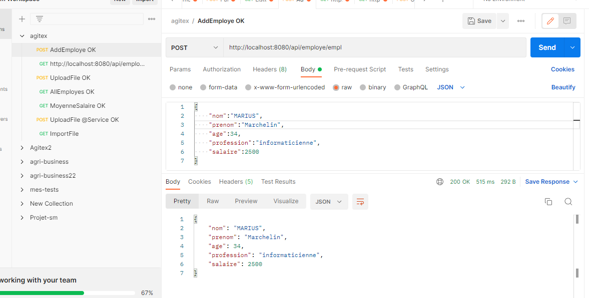
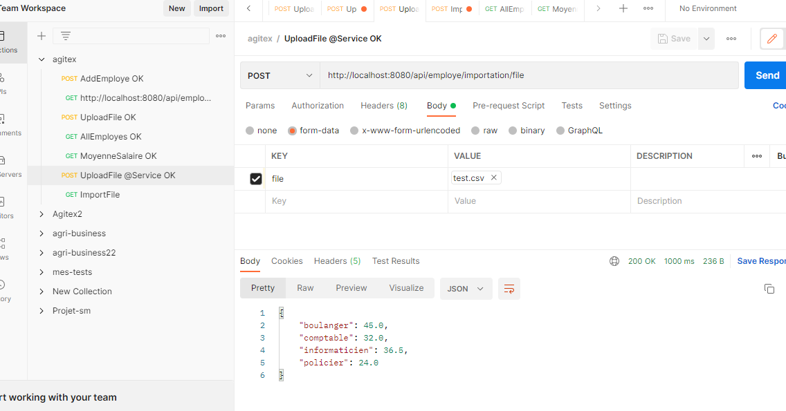

Titre du projet : climax

Fonctionnalités
Fonctionnalité 1: importer un fichier csv (par la suite xml, txt, json,etc);
Fonctionnalité 2: calculer la moyenne des employés en fonction de leur profession

Capture d'écran

*Légende : Test de simulation d'ajout d'un nouveau employé.*

*Légende : Importation d'un fichier csv, calcul des moyenne en fonction de la profession.
NB: lors de l'apload du fichier, le fichier est enregistré dans un dossier temporaire de l'ordinateur
Voir la sortie pour trouver le repertoire
*

Installation
1.Clonez ce dépôt de code sur votre machine locale: gh repo clone guiralmagalie/climax
2. Installez les dépendances nécessaires: npm install
3. Configurez les fichiers de configuration: application.properties(
  -spring.datasource.url=jdbc:postgresql://localhost:5432/climax (créer le nom de la base de données dans postgres)
  -spring.datasource.username=votre_nom_utilisateur_postgres
  -spring.jpa.hibernate.ddl-auto=create (mettre à update après 1ère exécution)
  -spring.datasource.password=votre_mot_de_passe_postgres,
  --ajouter le reste de configuration
  )
4. Exécutez l'application: npm start 
5. Ouvrez votre navigateur web et accédez à l'URL suivante : http://localhost:3000.
6. Interagissez avec l'application en suivant les instructions à l'écran.

Pre requis
- intelliJ
- postgreSql
- postman

